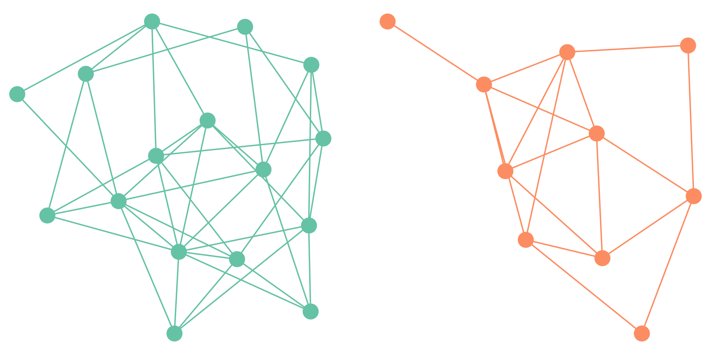

<style scoped> 
p {
    font-size: 24px;
}
</style>

# Maggot brain, mirror image? A statistical analysis of bilateral symmetry in an insect brain connectome

### Benjamin D. Pedigo

_Johns Hopkins University_
_[NeuroData lab](https://neurodata.io/)_
[_@bdpedigo (Github)_](https://github.com/bdpedigo)
[_@bpedigod (Twitter)_](https://twitter.com/bpedigod)
[_bpedigo@jhu.edu_](mailto:bpedigo@jhu.edu)


---

# What is a connectome? (for *this* talk)

A **connectome** is a network model of brain structure consisting of <span style="color: black"> nodes which 
represent individual neurons </span> and <span style="color: black"> edges which represent the presence of a synaptic 
connection </span> between those neurons.

---
# Many connectomics questions require comparison
- Understand wiring substrate of learning/memory
- Understand links between genetics or disease and connectivity
- Understand how different neural architectures lead to different computational abilities

<p></p>
<p></p>
<p></p>

> "Understanding statistical regularities and learning which variations are stochastic and which are secondary to an animal’s life history will help define the substrate upon which individuality rests and *require comparisons between circuit maps within and between animals.*" [1] (emphasis added)

<footer>
[1] Abbott, Larry F., et al. "The mind of a mouse." Cell  (2020)
</footer>

--- 

# Larval _Drosophila_ brain connectome
- ~2500 brain neurons + ~500 sensory neurons
- ~544K synapses
- Both hemispheres of the brain reconstructed

<!-- TODO say something about how we are treating as directed, unweighted, loopless -->

---

<style scoped>
section {
    justify-content: center;
}
</style>

# Are the <span style="color: var(--left)"> left </span> and the <span style="color: var(--right)"> right </span> sides of this brain *the same*?

--- 

# Are these populations the same? 
- Known as two-sample testing
- $\color{#66c2a5} Y^{(1)} \sim F^{(1)}$, $\color{#fc8d62} Y^{(2)} \sim F^{(2)}$
- $H_0: \color{#66c2a5} F^{(1)} \color{black} = \color{#fc8d62} F^{(2)}$  
  vs.
  $H_A: \color{#66c2a5} F^{(1)} \color{black} \neq \color{#fc8d62} F^{(2)}$


<!--  -->

--- 
# Are these two _networks_ the same?
<div class="twocols">

- Left side network: $\color{#66c2a5} A^{(L)} \sim F^{(L)}$ 
- Right side network: $\color{#fc8d62} A^{(R)} \sim F^{(R)}$

- $H_0: \color{#66c2a5} F^{(L)} \color{black} = \color{#fc8d62}F^{(R)}$  
  vs.  
  $H_A: \color{#66c2a5} F^{(L)} \color{black} \neq  \color{#fc8d62} F^{(R)}$
<p class="break"></p>

<!-- TODO add some text here to the networks plots -->


</div>


---
<!-- <style scoped>section { justify-content: start; }</style> -->
# The simplest thing: Erdos-Renyi (ER) model
<div class="twocols">

- Each edge is sampled independently, same connection probability $p$ for all edges
-  $A_{ij} \sim Bernoulli(p)$
- Compare $\color{#66c2a5} \hat{p}^{(L)}$ vs $\color{#fc8d62} \hat{p}^{(R)}$ (binomial test)

<!-- TODO fix this centering -->
<p style="text-align: center"> 
**p-value $< 10^{-23}$**
</p>

<p class="break"></p>


</div>

<style scoped>
section {
  padding-right: -100;
}
</style>
<!--  -->


--- 

# Testing under the stochastic block model (SBM)

<div class="twocols">

- Connections independent, with probability set by the <span style="color: #ed7d31"> source node's group </span> and <span style="color: #4472c4"> target node's group </span>
- $A_{ij} \sim Bernoulli(B_{\color{#ed7d31}\tau_i, \color{#4472c4}\tau_j})$
- Compare group-to-group connection probabilities:
  $H_0: \color{#66c2a5} B^{(L)} \color{black} = \color{#fc8d62} B^{(R)}$  
  vs.  
  $H_A: \color{#66c2a5} B^{(L)} \color{black} \neq  \color{#fc8d62} B^{(R)}$
- **p-value $< 10^{-4}$** 

<p class="break"></p>

<!-- TODO remake but without B L R etc. -->
 


</div>

--- 

# Correcting for a difference in density

<div class="twocols">

- Perhaps rejecting $\color{#66c2a5} B^{(L)} \color{black} = \color{#fc8d62} B^{(R)}$ can be explained by the difference in density from the ER test?
- New null hypothesis:
  $H_0: \color{#66c2a5}B^{(L)} \color{black}  = c \color{#fc8d62}B^{(R)}$  
  where $c$ is a density-normalizing constant, $\frac{\color{#66c2a5} p^{(L)}}{\color{#fc8d62} p^{(R)}}$

<p class="break"></p>


</div>


---
# An even more flexible model: Random dot product graph (RDPG)

---
# RDPG results 

--- 
# How sensitive are they? 

---
# Summary
- Even for a simple question like "are the left and right the same," there are many 
different ways to write down what we mean as a statistical hypothesis
   - Each yields a different test procedure 
   - Each test is sensitive to varying alternatives 
- We may care about some differences and not others (e.g. density) and any test will need to adjust for that
- These techniques apply anytime one wants to compare connectomes/networks

--- 
<!-- # ```graspologic``` -->

<div class="twocols">

## graspologic:

[github.com/microsoft/graspologic](https://github.com/microsoft/graspologic)


[](https://pepy.tech/project/graspologic)  [](https://github.com/microsoft/graspologic)  [](https://github.com/microsoft/graspologic/graphs/contributors)  [](https://opensource.org/licenses/MIT)
<p class="break"></p>

## This work:
[github.com/neurodata/bilateral-connectome](https://github.com/neurodata/bilateral-connectome) 


</div>

---
# Acknowledgements

<style scoped> 
p {
    font-size: 24px
}
h4 {font-size: 30px}
</style>

#### Johns Hopkins University
Joshua Vogelstein, Carey Priebe, Mike Powell, Eric Bridgeford, Kareef Ullah, Diane Lee, Sambit Panda, Jaewon Chung, Ali Saad-Eldin

#### University of Cambridge / Laboratory of Molecular Biology 
Michael Winding, Albert Cardona, Marta Zlatic, Chris Barnes

#### Microsoft Research 
Hayden Helm, Dax Pryce, Nick Caurvina, Bryan Tower, Patrick Bourke, Jonathan McLean, Carolyn Buractaon, Amber Hoak

---
# Questions?